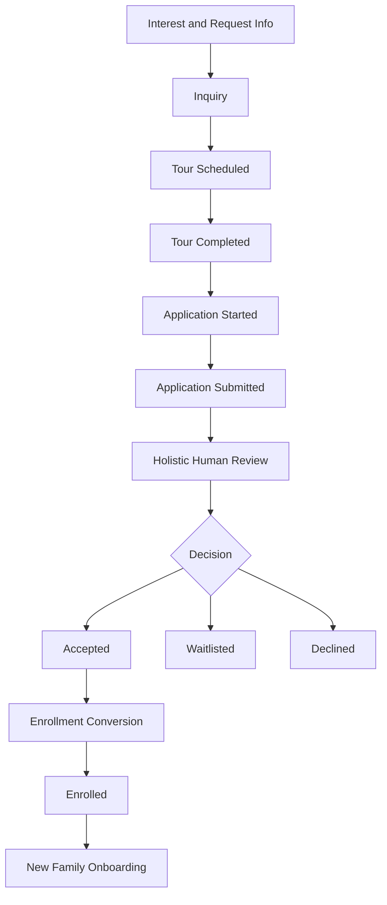

# Admissions Funnel Visual Preview

This page provides a quick visual of the current admissions funnel design and the mapped runtime routes.

## 1) End-to-End Funnel



## 2) Route-Level Experience Map

```mermaid
flowchart LR
    P[Public Entry] --> P1[/admissions/apply]
    P --> P2[/apply]
    P2 --> P1

    O[Operations View] --> O1[/admissions]
    O --> O2[/admissions/dashboard]
    O --> O3[/admissions/pipeline]

    O --> O4[/admissions-dashboard]
```

## 3) Guard Model

- Public submit path:
  - /admissions/apply
  - /apply redirect
- Admissions operations path:
  - /admissions
  - /admissions/dashboard
  - /admissions/pipeline
- Role-guarded admissions dashboard registry path:
  - /admissions-dashboard

## 4) API Surfaces Used by Funnel and Wizard

- GET /api/v1/admissions/summary/
- GET /api/v1/admissions/drilldown/
- POST /api/v1/admissions/submit/
- GET /api/admissions/applications/
- GET /api/admissions/applications/{id}/
- POST /api/v1/admissions/enroll/

## 5) Household-Centric Review Design

The operations drawer in Admissions Pipeline now centers on household review:

- Household summary card
- Guardian contact rail
- Multi-child application cards
- Per-child enroll action

This supports admissions decisions at household level while preserving child-level enrollment control.

## 6) Operational Status

Current state reflects implemented and tested behavior:

- Public wizard submit endpoint present and validated
- Admissions links list and detail endpoints validated
- Admissions pipeline UI mapped to household review experience

## 7) Primary Source Links

- Industry benchmark and mission-fit comparison:
  - docs/admissions/ADMISSIONS_WIZARD_BENCHMARK_20260522.md

- Phased execution backlog with 25 improvements:
  - docs/admissions/ADMISSIONS_WIZARD_IMPROVEMENT_BACKLOG_20260522.md

- Sprint 1-6 execution board with ticket IDs and dependencies:
  - docs/admissions/ADMISSIONS_WIZARD_SPRINT_BOARD_20260522.md

- Mission-aligned process baseline:
  - docs/admissions/ADMISSIONS_FUNNEL_PROCESS_MISSION_ALIGNED.md
- Runtime pipeline page:
  - frontend/dashboards/src/pages/AdmissionsPipelineList.jsx
- Public admissions wizard page:
  - frontend/dashboards/src/pages/ProspectiveFamilyAdmissionsWizard.jsx
- Route wiring:
  - frontend/dashboards/src/routes/router.jsx
- Route constants:
  - frontend/dashboards/src/routes/paths.js
