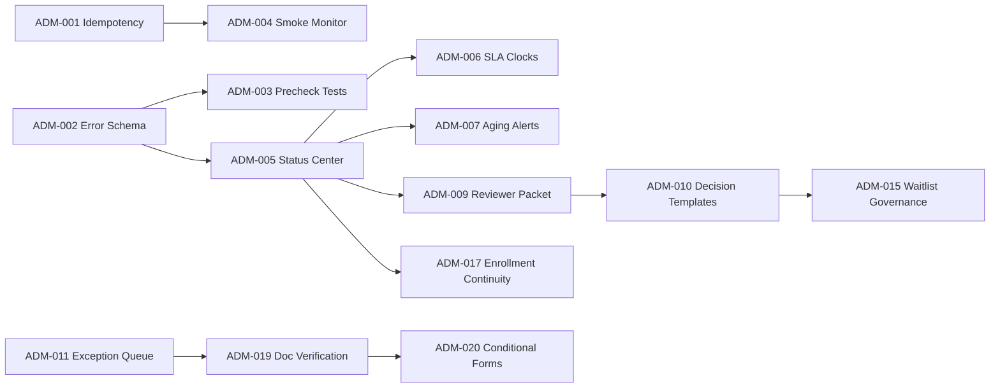

# Admissions Wizard Sprint Board (Sprint 1 to Sprint 6)

Date: 2026-05-22
Source: 25-item improvement backlog derived from general admissions workflow research and school-user needs.
Planning horizon: 6 sprints (2 weeks each)

Execution process reference:
- docs/admissions/ADMISSIONS_DELIVERY_PROCESS_PLAYBOOK_20260522.md

## Team Capacity Assumptions

- Product: 12 points per sprint
- Frontend: 24 points per sprint
- Backend: 24 points per sprint
- Data/Analytics: 12 points per sprint
- QA: 16 points per sprint
- Admissions Ops: 10 points per sprint

## Story Point Legend

- 1 = tiny
- 2 = small
- 3 = medium
- 5 = large
- 8 = extra large

## Sprint 1 (P0 Reliability Baseline)

Goal: eliminate high-risk submit failures and establish reliability observability.

1. ADM-001 - Submit idempotency token and duplicate prevention
- Points: 8
- Owners: Backend, QA
- Dependencies: none
- Done when:
  - Duplicate submit retries create one application record.
  - Idempotency key persisted and validated.

2. ADM-002 - Structured admissions submit error schema
- Points: 5
- Owners: Backend, Frontend
- Dependencies: none
- Done when:
  - Submit errors return code, message, detail, correlation id.

3. ADM-003 - Final step service precheck regression tests
- Points: 3
- Owners: QA, Frontend
- Dependencies: ADM-002
- Done when:
  - Automated tests cover checking, down, ready states.

4. ADM-004 - Submit smoke monitor and alert policy
- Points: 5
- Owners: Backend, Data/Analytics
- Dependencies: ADM-001, ADM-002
- Done when:
  - Scheduled synthetic check emits success rate and alerts.

## Sprint 2 (P0 Family Trust)

Goal: make family expectations clear at every stage and reduce uncertainty.

1. ADM-005 - Family status center (stage, owner, next milestone)
- Points: 8
- Owners: Frontend, Backend
- Dependencies: ADM-002
- Done when:
  - Post-submit view shows current stage and last update time.

2. ADM-006 - SLA clocks for first response and review
- Points: 5
- Owners: Product, Frontend, Admissions Ops
- Dependencies: ADM-005
- Done when:
  - SLA targets visible and configurable by campus/program.

3. ADM-007 - No-follow-up aging alert workflow
- Points: 5
- Owners: Backend, Admissions Ops, Data/Analytics
- Dependencies: ADM-005
- Done when:
  - Aging threshold flags and escalations are triggered.

4. ADM-008 - Persistent completion chips and readiness rail
- Points: 3
- Owners: Frontend
- Dependencies: none
- Done when:
  - Completion state is visible and accurate through review/submit.

## Sprint 3 (P1 Reviewer Excellence)

Goal: improve reviewer quality, speed, and decision consistency.

1. ADM-009 - Reviewer packet auto-summary (household plus per-child)
- Points: 8
- Owners: Backend, Frontend, Admissions Ops
- Dependencies: ADM-005
- Done when:
  - Packet shows normalized family profile and student summaries.

2. ADM-010 - Decision reason templates with required rationale
- Points: 5
- Owners: Admissions Ops, Backend
- Dependencies: ADM-009
- Done when:
  - Decision action requires reason code and notes.

3. ADM-011 - Exception queue for incomplete/conflicting records
- Points: 5
- Owners: Backend, Frontend, QA
- Dependencies: ADM-002
- Done when:
  - Exception queue lifecycle states are operational.

4. ADM-012 - Communication playbook integration v1
- Points: 3
- Owners: Admissions Ops, Product
- Dependencies: ADM-010
- Done when:
  - Stage templates are available and mapped to workflow events.

## Sprint 4 (P1 Operational Control)

Goal: optimize throughput and reduce bottlenecks with measurable control.

1. ADM-013 - Funnel bottleneck heatmap dashboard
- Points: 5
- Owners: Data/Analytics, Product
- Dependencies: ADM-005, ADM-007
- Done when:
  - Aging and bottleneck hotspots by stage are visible.

2. ADM-014 - Counselor workload balancing board
- Points: 5
- Owners: Frontend, Data/Analytics, Admissions Ops
- Dependencies: ADM-013
- Done when:
  - Workload distribution and reassignment controls are available.

3. ADM-015 - Waitlist governance workflow
- Points: 5
- Owners: Product, Admissions Ops, Backend
- Dependencies: ADM-010
- Done when:
  - Waitlist reasons, cadence, and communications are enforced.

4. ADM-016 - Weekly inquiry-to-enrollment forecast model
- Points: 5
- Owners: Data/Analytics
- Dependencies: ADM-013
- Done when:
  - Forecast versus actual variance is published weekly.

## Sprint 5 (P2 Conversion Continuity)

Goal: prevent drop-off after acceptance and keep one-portal continuity.

1. ADM-017 - Acceptance-to-enrollment checklist continuity
- Points: 8
- Owners: Product, Backend, Frontend
- Dependencies: ADM-005, ADM-010
- Done when:
  - Accepted families receive enrollment checklist in the same journey.

2. ADM-018 - Event scheduling integration (tour/interview/shadow)
- Points: 8
- Owners: Backend, Frontend
- Dependencies: ADM-005
- Done when:
  - Family can book events and event outcomes update stages.

3. ADM-019 - Secure document upload and verification workflow
- Points: 8
- Owners: Backend, Frontend, QA
- Dependencies: ADM-011
- Done when:
  - Upload, verification, and remediation loop is operational.

## Sprint 6 (P2 Scale and Experience)

Goal: improve long-term conversion and premium parent experience.

1. ADM-020 - Conditional forms by program/grade/support profile
- Points: 8
- Owners: Product, Frontend, Backend
- Dependencies: ADM-019
- Done when:
  - Dynamic form rules render and validate correctly.

2. ADM-021 - Notification preference center (email and SMS consent)
- Points: 5
- Owners: Frontend, Backend, Admissions Ops
- Dependencies: ADM-005
- Done when:
  - Families can manage channel preferences with audit trail.

3. ADM-022 - Multilingual admissions surfaces (phase 1)
- Points: 5
- Owners: Frontend, Product
- Dependencies: ADM-005
- Done when:
  - Wizard and status center available in two languages.

4. ADM-023 - Premium trust-design refresh and accessibility uplift
- Points: 8
- Owners: Frontend, Product, QA
- Dependencies: ADM-006, ADM-008
- Done when:
  - Key wizard screens meet WCAG 2.1 AA.
  - Conversion funnel uplift baseline and post-release metrics captured.

## Carryover Backlog (Post Sprint 6)

These map to remaining strategic items from the 25-list and should be slotted after Sprint 6:

1. ADM-024 - Mission conversation completion KPI instrumentation
2. ADM-025 - 30/90-day first-term retention feedback loop

## Dependency Graph (High Level)

## Paste-Ready Team Update

Admissions Wizard benchmark outputs have been converted into a 6-sprint execution board with 25 mapped improvements, ticket IDs (ADM-001 to ADM-025), owner lanes, points, dependencies, and done criteria. Execution starts with P0 submit reliability and family trust controls in Sprint 1-2, then reviewer and operations maturity in Sprint 3-4, then enrollment continuity and premium UX in Sprint 5-6.
