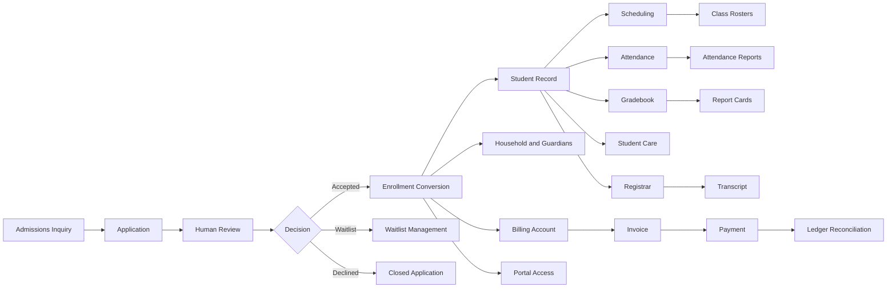
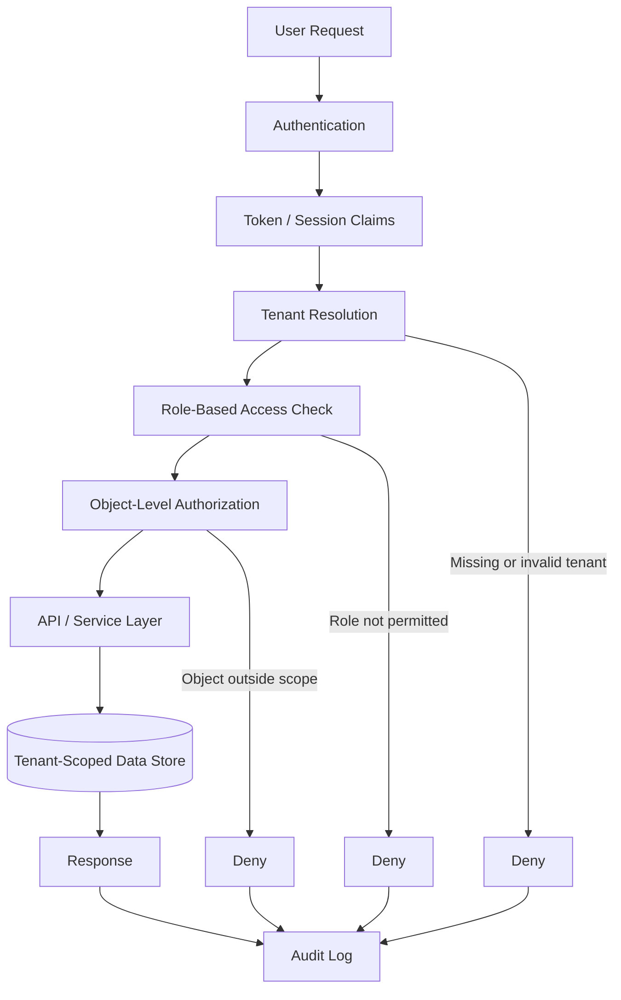
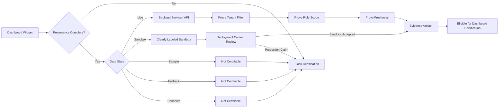
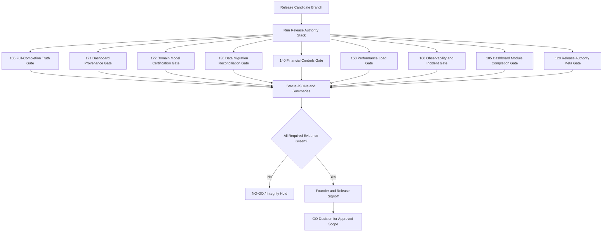
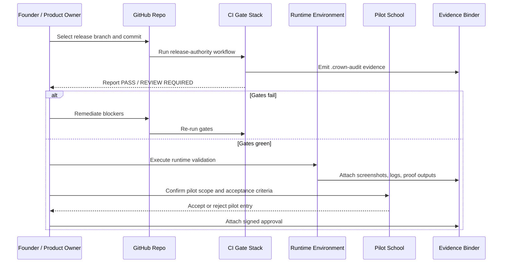
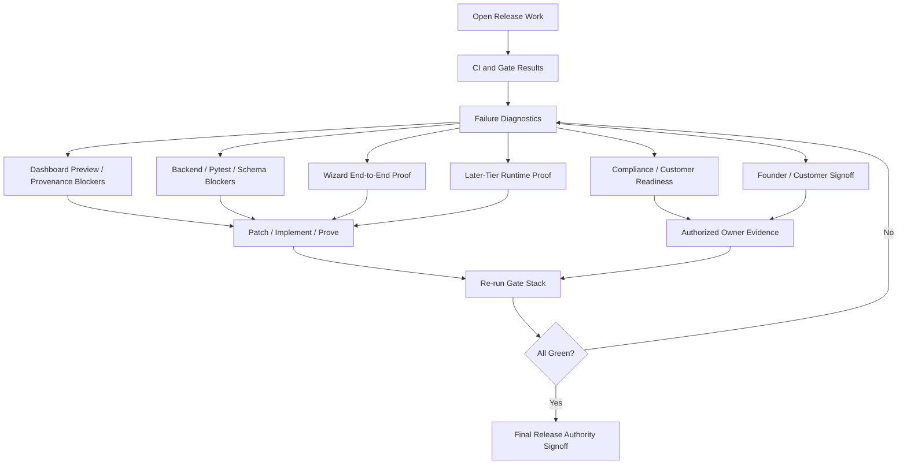
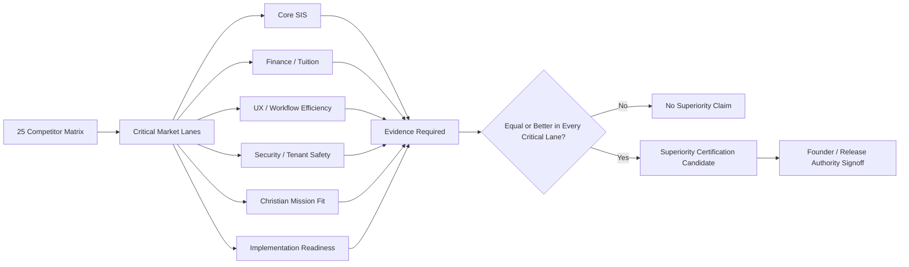
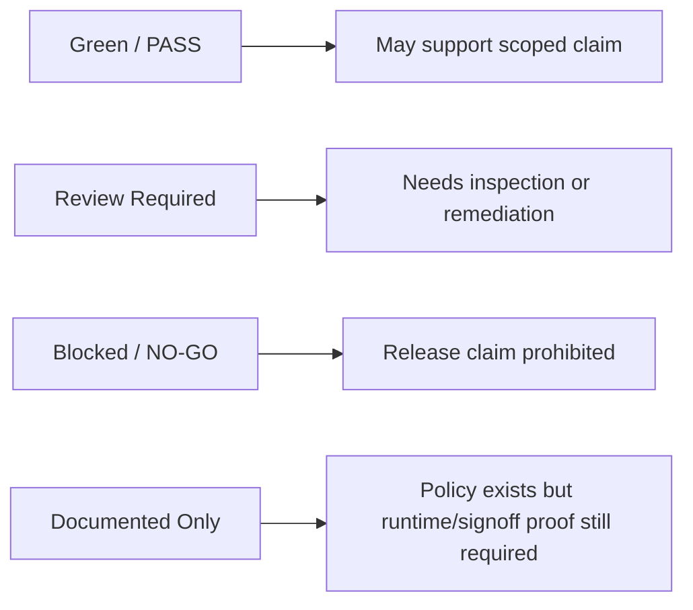

# CROWN Printed Binder Mermaid Visuals — 2026-05-29

## Purpose

This document provides binder-ready visual diagrams for CROWN using Mermaid. These diagrams are intended for printed executive, architect, investor, school-leader, and release-authority binders.

## Current certification note

These visuals describe the intended and governed architecture. They do **not** certify CROWN as GA, pilot-approved, unrestricted-production ready, or superior-certified. Current release authority remains controlled by the release gates and evidence artifacts.

## Printing guidance

Recommended binder use:

1. Open this Markdown file in GitHub or a Mermaid-capable Markdown viewer.
2. Let Mermaid render the diagrams.
3. Print to PDF or paper from the rendered preview.
4. Use landscape orientation for the larger system maps.
5. Keep this file paired with:
   - `docs/release/CROWN_RELEASE_AUTHORITY_INDEX_20260529.md`
   - `docs/release/CROWN_CORE_SIS_SUPERIORITY_GATE_20260529.md`
   - `docs/release/CROWN_OWNER_RUNTIME_PROOF_ACTION_PACKET_20260529.md`

---

# 1. Executive System Map

```mermaid
flowchart TB
    CROWN[CROWN\nChristian School Management Solution]

    CROWN --> SIS[Core SIS]
    CROWN --> FIN[Finance and Billing]
    CROWN --> FAMILY[Family Engagement]
    CROWN --> OPS[School Operations]
    CROWN --> MISSION[Mission and Formation]
    CROWN --> PLATFORM[Platform Governance]

    SIS --> STUDENTS[Students]
    SIS --> HOUSEHOLDS[Households and Guardians]
    SIS --> ATTENDANCE[Attendance]
    SIS --> SCHEDULING[Scheduling]
    SIS --> GRADEBOOK[Gradebook]
    SIS --> REGISTRAR[Registrar and Transcripts]

    FIN --> TUITION[Tuition Plans]
    FIN --> INVOICES[Invoices]
    FIN --> PAYMENTS[Payments]
    FIN --> AID[Financial Aid]
    FIN --> LEDGER[Ledger and Reconciliation]

    FAMILY --> PORTALS[Parent and Student Portals]
    FAMILY --> COMMS[Communications]
    FAMILY --> ADMISSIONS[Admissions and Enrollment]
    FAMILY --> REENROLL[Re-enrollment]

    OPS --> HR[HR and Staff]
    OPS --> FACILITIES[Facilities]
    OPS --> HEALTH[Health Office]
    OPS --> TRANSPORT[Transportation]
    OPS --> FOOD[Food Service]
    OPS --> SAFETY[Safety and Security]

    MISSION --> SPIRITUAL[Spiritual Life]
    MISSION --> SERVICE[Service Hours]
    MISSION --> CARE[Student Care]
    MISSION --> ADVANCEMENT[Advancement and Alumni]

    PLATFORM --> TENANT[Tenant Isolation]
    PLATFORM --> RBAC[RBAC and Object Authorization]
    PLATFORM --> DASH[Dashboard Provenance]
    PLATFORM --> RELEASE[Release Authority Gates]
    PLATFORM --> OBS[Observability and Incident Readiness]
```

---

# 2. Core SIS Operating Flow

---

# 3. Tenant, RBAC, and Object-Authorization Flow

---

# 4. Dashboard Data Provenance Flow

---

# 5. Release Authority Gate Stack

---

# 6. Evidence Binder Artifact Map

```mermaid
flowchart TB
    BINDER[Printed Binder]

    BINDER --> ARCH[Architecture Section]
    BINDER --> SIS[Core SIS Section]
    BINDER --> SECURITY[Security and Tenant Section]
    BINDER --> DASH[Dashboard Truth Section]
    BINDER --> RELEASE[Release Authority Section]
    BINDER --> OPS[Operations Section]
    BINDER --> SIGN[Signoff Section]

    ARCH --> A1[CROWN System Architecture]
    ARCH --> A2[Module Map]
    ARCH --> A3[Wiring / Plumbing Flow]

    SIS --> S1[Domain Model Certification]
    SIS --> S2[Workflow Proof Register]
    SIS --> S3[Wizard Proof Register]

    SECURITY --> SE1[Tenant Isolation Evidence]
    SECURITY --> SE2[RBAC Evidence]
    SECURITY --> SE3[Object Authorization Evidence]

    DASH --> D1[Dashboard Provenance Contract]
    DASH --> D2[Widget Provenance CSV]
    DASH --> D3[Sample / Fallback Violation Report]

    RELEASE --> R1[Release Authority Index]
    RELEASE --> R2[Gate Stack Summary]
    RELEASE --> R3[Blocking Markers Report]

    OPS --> O1[Backup / Restore Evidence]
    OPS --> O2[Incident Readiness Evidence]
    OPS --> O3[Go-Live Runbook]

    SIGN --> F1[Founder Signoff]
    SIGN --> L1[Legal / Compliance Approval]
    SIGN --> C1[Customer / Pilot Acceptance]
```

---

# 7. Pilot and Go-Live Sequence

---

# 8. Current Blocker Resolution Flow

---

# 9. Competitive Superiority Proof Flow

---

# 10. Binder Status Legend

## Final binder note

Use these visuals as a map of CROWN's intended and governed architecture. Use the `.crown-audit` evidence outputs and signed release authority files as the proof source for whether a claim is allowed.
